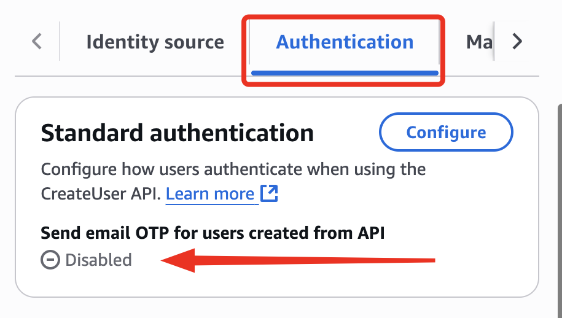
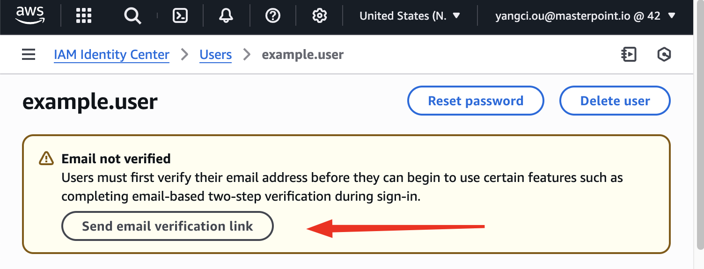

[![Banner][banner-image]](https://masterpoint.io/)

# terraform-aws-identity-center-users

[![Release][release-badge]][latest-release]

💡 Learn more about Masterpoint [below](#who-we-are-𐦂𖨆𐀪𖠋).

## Purpose and Functionality

This Terraform module provisions, configures, and manages AWS IAM Identity Center (SSO) with built-in user provisioning, including assigning users, groups, and permission sets.

- This is designed to be seamless for organizations that want to **manage users within the AWS Identity Center directory as their identity source** instead of an external identity provider (such as Okta, Azure Active Directory, etc.). This means that all users are managed by IaC.

### Notes

- Authentication is handled by AWS Identity Center. Upon user creation by TF, the user will be in AWS Identity Center directory.
  - However, the AWS Terraform provider does not support the setting the option to send credentials/verification email after creation, so the administrator must go into the AWS Identity Center directory console and and enable ["Send email OTP for users created from API"](https://docs.aws.amazon.com/singlesignon/latest/userguide/userswithoutpwd.html), or manually request to send a verification email per each user so users can reset their own password.
    
    

## Usage

### Prerequisites

- You will need to manually (ClickOps) enable AWS Identity Center & create an SSO instance in the AWS account that you want to be set as the "management account" for your organization. See https://docs.aws.amazon.com/singlesignon/latest/userguide/enable-identity-center.html.
  - The SSO instance itself is not managed by Terraform, there is no Terraform resource for it. Settings like MFA configurations must be updated on the AWS console ClickOps.
- After enabling, Terraform can reference it using the `data "aws_ssoadmin_instances" "sso" {}` data source.

### See below for a simplistic example of how to use this module

```hcl
data "aws_ssoadmin_instances" "sso" {}

locals {
  instance_arn      = tolist(data.aws_ssoadmin_instances.sso.arns)[0]
  identity_store_id = tolist(data.aws_ssoadmin_instances.sso.identity_store_ids)[0]
}

module "aws_sso" {
  source = "github.com/masterpointio/terraform-aws-identity-center-users?ref=v1.x.x"

  instance_arn      = local.instance_arn
  identity_store_id = local.identity_store_id

  users = [
    {
      user_name   = "john.doe"
      given_name  = "John"
      family_name = "Doe"
      email       = "john.doe@example.com"
    },
  ]

  groups = [
    {
      name        = "Administrators"
      description = "Full administrative access"
      members     = ["john.doe"]
      assignments = [
        {
          permission_set = "AdministratorAccess"
          account_ids    = ["123456789012", "234567890123"]
        }
      ]
    },
  ]

  permission_sets = [
    {
      name             = "AdministratorAccess"
      description      = "Full administrator access to an account."
      session_duration = "PT12H"
      managed_policies = [
        "arn:aws:iam::aws:policy/AdministratorAccess"
      ]
    }
  ]
}
```

## Examples

Here are some examples of using this module:

- [`examples/complete`](./examples/complete) - example using a `tfvars` file to manage users, groups, and permission sets
- [`examples/json-user-management`](./examples/json-user-management) - example using a `json` file to manage users, groups, and permission sets
- [`examples/yaml-user-management`](./examples/yaml-user-management) - example using a `yaml` file to manage users, groups, and permission sets

<!-- prettier-ignore-start -->
<!-- markdownlint-disable MD013 -->
<!-- BEGINNING OF PRE-COMMIT-TERRAFORM DOCS HOOK -->
## Requirements

| Name | Version |
|------|---------|
| <a name="requirement_terraform"></a> [terraform](#requirement\_terraform) | >= 1.0.0 |
| <a name="requirement_aws"></a> [aws](#requirement\_aws) | >= 5.0 |

## Providers

| Name | Version |
|------|---------|
| <a name="provider_aws"></a> [aws](#provider\_aws) | >= 5.0 |

## Modules

No modules.

## Resources

| Name | Type |
|------|------|
| [aws_identitystore_group.groups](https://registry.terraform.io/providers/hashicorp/aws/latest/docs/resources/identitystore_group) | resource |
| [aws_identitystore_group_membership.memberships](https://registry.terraform.io/providers/hashicorp/aws/latest/docs/resources/identitystore_group_membership) | resource |
| [aws_identitystore_user.users](https://registry.terraform.io/providers/hashicorp/aws/latest/docs/resources/identitystore_user) | resource |
| [aws_ssoadmin_account_assignment.assignments](https://registry.terraform.io/providers/hashicorp/aws/latest/docs/resources/ssoadmin_account_assignment) | resource |
| [aws_ssoadmin_customer_managed_policy_attachment.customer_policies](https://registry.terraform.io/providers/hashicorp/aws/latest/docs/resources/ssoadmin_customer_managed_policy_attachment) | resource |
| [aws_ssoadmin_managed_policy_attachment.policies](https://registry.terraform.io/providers/hashicorp/aws/latest/docs/resources/ssoadmin_managed_policy_attachment) | resource |
| [aws_ssoadmin_permission_set.permissions](https://registry.terraform.io/providers/hashicorp/aws/latest/docs/resources/ssoadmin_permission_set) | resource |
| [aws_ssoadmin_permission_set_inline_policy.inline_policies](https://registry.terraform.io/providers/hashicorp/aws/latest/docs/resources/ssoadmin_permission_set_inline_policy) | resource |

## Inputs

| Name | Description | Type | Default | Required |
|------|-------------|------|---------|:--------:|
| <a name="input_groups"></a> [groups](#input\_groups) | List of SSO groups | <pre>list(object({<br/>    name        = string<br/>    description = string<br/>    members     = list(string)<br/>    assignments = optional(list(object({<br/>      permission_set = string<br/>      account_ids    = list(string)<br/>    })), [])<br/>  }))</pre> | n/a | yes |
| <a name="input_identity_store_id"></a> [identity\_store\_id](#input\_identity\_store\_id) | Identity store ID | `string` | n/a | yes |
| <a name="input_instance_arn"></a> [instance\_arn](#input\_instance\_arn) | SSO instance ARN | `string` | n/a | yes |
| <a name="input_permission_sets"></a> [permission\_sets](#input\_permission\_sets) | List of permission sets | <pre>list(object({<br/>    name             = string<br/>    description      = string<br/>    managed_policies = optional(list(string), [])<br/>    session_duration = optional(string, "PT12H") # The length of time that the application user sessions in the ISO-8601 standard<br/>    inline_policy    = optional(string, null)<br/>    relay_state      = optional(string, null)<br/>    tags             = optional(map(string), {})<br/>    customer_managed_policy_attachments = optional(list(object({<br/>      name = string<br/>      path = optional(string, "/")<br/>    })), [])<br/>  }))</pre> | n/a | yes |
| <a name="input_users"></a> [users](#input\_users) | List of SSO users | <pre>list(object({<br/>    user_name   = string<br/>    given_name  = string<br/>    family_name = string<br/>    email       = string<br/>  }))</pre> | n/a | yes |

## Outputs

| Name | Description |
|------|-------------|
| <a name="output_account_assignments"></a> [account\_assignments](#output\_account\_assignments) | List of account assignments. |
| <a name="output_group_memberships"></a> [group\_memberships](#output\_group\_memberships) | List of group memberships. |
| <a name="output_groups"></a> [groups](#output\_groups) | Map of groups. |
| <a name="output_permission_sets"></a> [permission\_sets](#output\_permission\_sets) | Map of permission sets. |
| <a name="output_users"></a> [users](#output\_users) | Map of users. |
<!-- END OF PRE-COMMIT-TERRAFORM DOCS HOOK -->
<!-- markdownlint-enable MD013 -->
<!-- prettier-ignore-end -->

## Built By

Powered by the [Masterpoint team](https://masterpoint.io/who-we-are/) and driven forward by contributions from the community ❤️

[![Contributors][contributors-image]][contributors-url]

## Contribution Guidelines

Contributions are welcome and appreciated!

Found an issue or want to request a feature? [Open an issue][issues-url]

Want to fix a bug you found or add some functionality? Fork, clone, commit, push, and PR — we'll check it out.

## Who We Are 𐦂𖨆𐀪𖠋

Established in 2016, Masterpoint is a team of experienced software and platform engineers specializing in Infrastructure as Code (IaC). We provide expert guidance to organizations of all sizes, helping them leverage the latest IaC practices to accelerate their engineering teams.

### Our Mission

Our mission is to simplify cloud infrastructure so developers can innovate faster, safer, and with greater confidence. By open-sourcing tools and modules that we use internally, we aim to contribute back to the community, promoting consistency, quality, and security.

### Our Commitments

- 🌟 **Open Source**: We live and breathe open source, contributing to and maintaining hundreds of projects across multiple organizations.
- 🌎 **1% for the Planet**: Demonstrating our commitment to environmental sustainability, we are proud members of [1% for the Planet](https://www.onepercentfortheplanet.org), pledging to donate 1% of our annual sales to environmental nonprofits.
- 🇺🇦 **1% Towards Ukraine**: With team members and friends affected by the ongoing [Russo-Ukrainian war](https://en.wikipedia.org/wiki/Russo-Ukrainian_War), we donate 1% of our annual revenue to invasion relief efforts, supporting organizations providing aid to those in need. [Here's how you can help Ukraine with just a few clicks](https://masterpoint.io/updates/supporting-ukraine/).

## Connect With Us

We're active members of the community and are always publishing content, giving talks, and sharing our hard earned expertise. Here are a few ways you can see what we're up to:

[![LinkedIn][linkedin-badge]][linkedin-url] [![Newsletter][newsletter-badge]][newsletter-url] [![Blog][blog-badge]][blog-url] [![YouTube][youtube-badge]][youtube-url]

... and be sure to connect with our founder, [Matt Gowie](https://www.linkedin.com/in/gowiem/).

## License

[Apache License, Version 2.0][license-url].

[![Open Source Initiative][osi-image]][license-url]

Copyright © 2016-2025 [Masterpoint Consulting LLC](https://masterpoint.io/)

<!-- MARKDOWN LINKS & IMAGES -->

[banner-image]: https://masterpoint-public.s3.us-west-2.amazonaws.com/v2/standard-long-fullcolor.png
[license-url]: https://opensource.org/license/apache-2-0
[osi-image]: https://i0.wp.com/opensource.org/wp-content/uploads/2023/03/cropped-OSI-horizontal-large.png?fit=250%2C229&ssl=1
[linkedin-badge]: https://img.shields.io/badge/LinkedIn-Follow-0A66C2?style=for-the-badge&logoColor=white
[linkedin-url]: https://www.linkedin.com/company/masterpoint-consulting
[blog-badge]: https://img.shields.io/badge/Blog-IaC_Insights-55C1B4?style=for-the-badge&logoColor=white
[blog-url]: https://masterpoint.io/updates/
[newsletter-badge]: https://img.shields.io/badge/Newsletter-Subscribe-ECE295?style=for-the-badge&logoColor=222222
[newsletter-url]: https://newsletter.masterpoint.io/
[youtube-badge]: https://img.shields.io/badge/YouTube-Subscribe-D191BF?style=for-the-badge&logo=youtube&logoColor=white
[youtube-url]: https://www.youtube.com/channel/UCeeDaO2NREVlPy9Plqx-9JQ
[release-badge]: https://img.shields.io/github/v/release/masterpointio/terraform-aws-identity-center-users?color=0E383A&label=Release&style=for-the-badge&logo=github&logoColor=white
[latest-release]: https://github.com/masterpointio/terraform-aws-identity-center-users/releases/latest
[contributors-image]: https://contrib.rocks/image?repo=masterpointio/terraform-aws-identity-center-users
[contributors-url]: https://github.com/masterpointio/terraform-aws-identity-center-users/graphs/contributors
[issues-url]: https://github.com/masterpointio/terraform-aws-identity-center-users/issues
